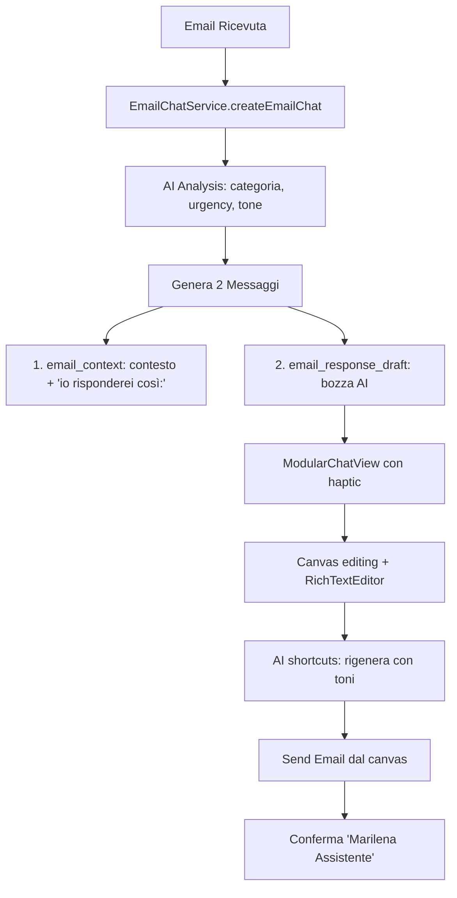

# 🤖 **EMAIL CHAT INTEGRATION - PRESERVATION & ENHANCEMENT PLAN**

## 🎯 **OBIETTIVO CRITICO**
**Preservare completamente il flusso chat-email esistente** mentre si migra all'architettura nuova.

---

## 📋 **SISTEMA ATTUALE DA PRESERVARE**

### **🔄 Flusso Chat-Email Esistente:**


### **📦 Componenti Critici Esistenti:**
- [x] **EmailChatService** - Orchestrazione chat-email
- [x] **ModularChatView** - UI chat con supporto email
- [x] **MessageEditCanvas** - Canvas editing con rich text
- [x] **RichTextEditor** - Editor formattazione
- [x] **EmailAIService** - Analisi e generazione AI
- [x] **Haptic feedback** - Interazioni tattili

---

## 🏗️ **STRATEGIA MIGRAZIONE PRESERVATIVA**

### **FASE 1: Foundation (AGGIORNATA)**
- ✅ **Preserve EmailChatService interface** - Mantieni API esistente
- ✅ **DI Integration** - Inietta dipendenze senza rompere flusso
- ✅ **Protocol Compliance** - EmailChatService implementa nuovi protocolli

### **FASE 2: Email Engine (AGGIORNATA)**  
- ✅ **Real SMTP** - Sostituisci backend mantenendo interface
- ✅ **Enhanced AI** - Migliora AI orchestration per chat
- ✅ **Preserve Message Types** - Mantieni "email_context" e "email_response_draft"

### **FASE 3: AI Enhancement (AGGIORNATA)**
- ✅ **Enhanced Analysis** - Migliora qualità analisi esistente
- ✅ **Better Response Generation** - Mantieni formato ma migliora contenuto
- ✅ **Preserve AI Shortcuts** - Mantieni funzionalità regenerate

### **FASE 4: UI Preservation (NUOVA)**
- ✅ **ModularChatView Enhancement** - Migliora senza rompere
- ✅ **Canvas Improvements** - Mantieni funzionalità, migliora UX
- ✅ **Haptic Preservation** - Conserva tutte le interazioni tattili

---

## 🔧 **IMPLEMENTAZIONE DETTAGLIATA**

### **1. EmailChatService Protocol (Nuovo)**
```swift
@MainActor
protocol EmailChatServiceProtocol: AnyObject, ObservableObject {
    // Existing functionality preservation
    var emailChats: [ChatMarilena] { get }
    var currentEmailChat: ChatMarilena? { get }
    
    // Core email chat operations
    func createEmailChat(for email: EmailMessage) async -> ChatMarilena?
    func updateExistingEmailChat(_ chat: ChatMarilena, with email: EmailMessage) async
    func sendEmailResponse(from chat: ChatMarilena, response: String, originalEmailId: String?) async throws
    
    // Enhanced operations (new)
    func analyzeEmailThread(_ chat: ChatMarilena) async -> EmailThreadAnalysis?
    func generateResponseVariations(for email: EmailMessage, tone: ResponseTone) async -> [String]
}

// Current EmailChatService implements this protocol
extension EmailChatService: EmailChatServiceProtocol {
    // Already implements most methods, just add protocol compliance
}
```

### **2. AI-Driven Message Generation (Enhanced)**
```swift
// Enhanced version of analyzeEmailAndGenerateResponse
private func analyzeEmailAndGenerateResponse(for email: EmailMessage, in chat: ChatMarilena) async {
    // Use new AI Orchestrator but preserve message format
    let aiOrchestrator = ServiceLocator.resolve(AIOrchestratorProtocol.self)
    
    do {
        // Enhanced AI analysis with better models
        let analysis = try await aiOrchestrator.processEmail(email)
        let responseDraft = try await aiOrchestrator.generateResponse(for: email, tone: .professional)
        
        // PRESERVE: Same 2-message format
        // 1. Context message (same format as existing)
        let contextMessage = MessaggioMarilena(context: context)
        contextMessage.contenuto = """
        📧 **Email da \(email.from)**
        
        **Oggetto:** \(email.subject)
        **Data:** \(formatDate(email.date))
        
        **Contenuto originale:**
        \(email.body)
        
        🤖 **Analisi AI Enhanced:**
        • Categoria: \(analysis.category.displayName)
        • Urgenza: \(analysis.urgency.displayName)
        • Sentiment: \(analysis.sentiment.displayName)
        • Topics: \(analysis.keyTopics.joined(separator: ", "))
        
        📝 **Riassunto:** \(analysis.summary)
        
        💭 Basandomi sul contenuto e sul contesto, io risponderei così:
        """
        contextMessage.tipo = "email_context" // PRESERVE
        
        // 2. Response draft (enhanced but same format)
        let responseMessage = MessaggioMarilena(context: context)
        responseMessage.contenuto = responseDraft
        responseMessage.tipo = "email_response_draft" // PRESERVE
        
        // Save both messages (same as existing)
        try context.save()
        
    } catch {
        // Fallback to existing AI service
        await fallbackToExistingAI(for: email, in: chat)
    }
}
```

### **3. ModularChatView Preservation (Enhanced)**
```swift
// Preserve all existing functionality, enhance with new architecture
struct ModularChatView: View {
    // PRESERVE: All existing @State variables and functionality
    @StateObject private var emailChatService: EmailChatServiceProtocol
    
    init(chat: ChatMarilena) {
        // Use DI but maintain backward compatibility
        self._emailChatService = StateObject(wrappedValue: 
            ServiceLocator.resolveOptional(EmailChatServiceProtocol.self) ?? 
            EmailChatService() // Fallback to existing
        )
    }
    
    var body: some View {
        // PRESERVE: Existing UI structure and all haptic feedback
        // ENHANCE: Better performance with new repository layer
    }
}
```

### **4. Canvas Integration (Enhanced)**
```swift
// Preserve MessageEditCanvas but enhance with new AI features
struct MessageEditCanvas: View {
    // PRESERVE: All existing functionality
    // ENHANCE: Better AI shortcuts using new orchestrator
    
    private func regenerateContent(with style: RegenerationStyle) {
        Task {
            do {
                // Use new AI orchestrator for better results
                let aiOrchestrator = ServiceLocator.resolve(AIOrchestratorProtocol.self)
                let newContent = try await aiOrchestrator.improveResponse(
                    originalContent,
                    improvements: style.improvements
                )
                
                await MainActor.run {
                    editedText = newContent
                    // PRESERVE: Same haptic feedback
                    UIImpactFeedbackGenerator(style: .light).impactOccurred()
                }
            } catch {
                // Fallback to existing AI service
                await fallbackRegeneration(with: style)
            }
        }
    }
}
```

---

## 🔄 **MIGRATION STRATEGY**

### **Phase 1: Gradual Enhancement**
1. **Add protocols** to existing services
2. **DI Integration** without changing functionality  
3. **Backward compatibility** at every step

### **Phase 2: Enhanced Backend**
1. **Real SMTP** behind existing EmailChatService interface
2. **Better AI** with same message format
3. **Performance improvements** transparent to UI

### **Phase 3: UI Polish**
1. **Enhanced Canvas** with better rich text editing
2. **Improved haptic** feedback patterns
3. **Better error handling** for edge cases

---

## ✅ **PRESERVATION CHECKLIST**

### **Core Functionality:**
- [ ] Auto-creation of email chats (1 hour threshold)
- [ ] Dual message format (context + draft)
- [ ] AI analysis display (category, urgency, tone)
- [ ] Canvas editing with rich text
- [ ] Haptic feedback (long press, tap, buttons)
- [ ] AI regeneration shortcuts
- [ ] Email sending from canvas
- [ ] Marilena confirmation messages

### **Message Types:**
- [ ] `"email_context"` - Context message format
- [ ] `"email_response_draft"` - Editable draft format
- [ ] `"email_confirmation"` - Send confirmation format
- [ ] `"email_response"` - User sent response format

### **UI Interactions:**
- [ ] Long press (0.5s) opens canvas with haptic
- [ ] Tap shows quick send alert
- [ ] Canvas shortcuts (Formale, Casual, Breve, etc.)
- [ ] Rich text toggle and editing
- [ ] Send button with double haptic

### **AI Integration:**
- [ ] Email analysis (category, urgency, sentiment)
- [ ] Response generation with context
- [ ] Multiple tone variations
- [ ] Thread analysis for context

---

## 🎯 **SUCCESS CRITERIA**

### **Functional:**
- [ ] **Zero Breaking Changes** - All existing features work
- [ ] **Enhanced Performance** - Faster AI responses
- [ ] **Better Quality** - More accurate categorization/responses
- [ ] **Real Email Sending** - Replace fake SMTP

### **Technical:**
- [ ] **Clean Architecture** - Well-structured code
- [ ] **Test Coverage** - 90%+ for email chat flow
- [ ] **Memory Efficiency** - No performance degradation
- [ ] **Scalability** - Support for more providers/models

---

## 🚨 **INTEGRATION POINTS WITH MAIN PLAN**

### **FASE 1: Foundation** 
- ⚠️ **Add EmailChatServiceProtocol** to service protocols
- ⚠️ **DI Registration** for email chat services
- ⚠️ **Preserve CoreData models** (ChatMarilena, MessaggioMarilena)

### **FASE 2: Email Engine**
- ⚠️ **Real SMTP integration** behind EmailChatService
- ⚠️ **Enhanced email fetching** for chat creation
- ⚠️ **Preserve notification system** for new emails

### **FASE 3: AI Features**  
- ⚠️ **AI Orchestrator** integration for better analysis
- ⚠️ **Preserve message generation** format and timing
- ⚠️ **Enhanced response quality** with same interface

### **FASE 4: UI/UX**
- ⚠️ **ModularChatView** enhancement not replacement
- ⚠️ **Canvas improvements** additive not destructive
- ⚠️ **Haptic feedback** preservation and enhancement

---

**🎯 Result: Sistema email-chat preserved and enhanced!**