# 🏗️ **MARILENA EMAIL SYSTEM - PIANO INTEGRATO COMPLETO**

## 📋 **EXECUTIVE SUMMARY**

**Obiettivo**: Trasformare il sistema email Marilena da prototipo fragile a servizio enterprise-grade **preservando completamente il sistema chat-email con assistente Marilena**

**Approccio**: Hybrid Refactoring con **Zero Breaking Changes** per il flusso chat-email esistente

**Timeline**: 10 giorni lavorativi strutturati

**Risultato**: Sistema email robusto + Chat AI Marilena enhanced + Architettura clean + Test coverage 90%+

---

## 🤖 **SISTEMA CHAT-EMAIL ESISTENTE (FOUNDATION CRITICA)**

### **✅ FLUSSO ATTUALE DA PRESERVARE AL 100%:**

```mermaid
graph TD
    A[Email Ricevuta] --> B[EmailService notification]
    B --> C[EmailChatService.createEmailChat]
    C --> D[AI Analysis: categoria/urgenza/tono]
    D --> E[Genera 2 Messaggi:]
    E --> F[1. email_context: 'io risponderei così:']
    E --> G[2. email_response_draft: bozza AI]
    G --> H[ModularChatView + haptic]
    H --> I[Long Press → Canvas edit]
    I --> J[RichTextEditor + AI shortcuts]
    J --> K[Send Email → Conferma Marilena]
```


### **🔧 COMPONENTI CRITICI ESISTENTI:**
- [x] **EmailChatService** - Orchestrazione completa chat-email
- [x] **ModularChatView** - UI chat con supporto email + haptic feedback
- [x] **MessageEditCanvas** - Canvas editing con rich text
- [x] **RichTextEditor** - Editor formattazione avanzata
- [x] **EmailAIService** - Analisi AI + generazione risposte
- [x] **Haptic feedback system** - Long press, tap, button feedback
- [x] **AI shortcuts** - Regenerazione toni (Formale, Casual, Breve, etc.)
- [x] **Thread management** - Gestione conversazioni per mittente
- [x] **Confirmation system** - Messaggi "Marilena Assistente"

### **⚠️ REQUISITO ASSOLUTO: ZERO BREAKING CHANGES**

---

## 🎯 **PROBLEMI IDENTIFICATI E SOLUZIONI INTEGRATE**

### **🚨 PROBLEMI CRITICI (BLOCCANTI)**

| Problema | Impatto | Soluzione Integrata | Preservazione Chat-Email |
|----------|---------|-------------------|------------------------|
| **SMTP Simulato** | Alto | Real SMTP con MailCore2 | ✅ Stesso EmailChatService.sendEmail() interface |
| **Dipendenze Circolari** | Alto | DI Container + lazy injection | ✅ EmailChatService mantiene dependencies |
| **Token Management Rotto** | Alto | Unified TokenManager | ✅ Auth trasparente per chat-email |
| **CoreData Chaos** | Medio | Repository Pattern + unified context | ✅ ChatMarilena/MessaggioMarilena preserved |

### **⚡ FUNZIONALITÀ MANCANTI (ENHANCEMENT)**

| Gap | Soluzione | Chat-Email Integration |
|-----|-----------|----------------------|
| **HTML Rendering** | Apple Mail Clone V2 | ✅ Email detail view enhanced |
| **AI Fragmentation** | AI Orchestrator | ✅ Better quality per chat responses |
| **Offline Sync** | Robust SyncManager | ✅ Chat persistence offline |
| **Error Handling** | Comprehensive ErrorHandler | ✅ Chat error recovery |

### **🔧 DEBITO TECNICO (ARCHITECTURE)**

| Issue | Architecture Solution | Backward Compatibility |
|-------|---------------------|----------------------|
| **No DI** | Clean Architecture + DI | ✅ Protocol compliance per existing services |
| **State Distributed** | Service Layer + Repository | ✅ EmailChatService enhanced not replaced |
| **No Testing** | 90%+ Test Coverage | ✅ Chat-email flow 100% tested |
| **Performance** | Optimized data layer | ✅ Faster chat creation + AI responses |

---

## 🏗️ **ARCHITETTURA INTEGRATA TARGET**

### **📐 CLEAN ARCHITECTURE CON CHAT-EMAIL PRESERVATION**

```
🎨 PRESENTATION LAYER
├── ModularChatView (ENHANCED) ← Chat-email UI preserved
├── MessageEditCanvas (ENHANCED) ← Canvas editing preserved  
├── AppleMailCloneView (NEW) ← Email detail enhanced
└── EmailListView (ENHANCED) ← List navigation improved

🧠 BUSINESS LAYER  
├── EmailChatOrchestrator (NEW) ← Wraps existing EmailChatService
├── AIOrchestrator (NEW) ← Enhanced AI for chat responses
├── SyncOrchestrator (NEW) ← Better email sync
└── EmailChatService (PROTOCOL) ← Existing service preserved

📦 SERVICE LAYER
├── EmailServiceV2 (NEW) ← Real SMTP behind existing interface
├── AIServiceV2 (NEW) ← Better AI maintaining message format
├── AuthService (NEW) ← Unified token management
└── CacheService (NEW) ← Performance optimization

🗄️ DATA LAYER
├── EmailRepository (NEW) ← Unified email data access
├── ChatRepository (NEW) ← ChatMarilena/MessaggioMarilena preserved
├── CoreDataService (NEW) ← Optimized context management
└── SecureStorage (NEW) ← Token/credential security

🔌 EXTERNAL APIS
├── Gmail API ← Enhanced integration
├── Outlook API ← Enhanced integration  
├── OpenAI API ← Orchestrated AI calls
└── Anthropic API ← Orchestrated AI calls
```

### **🔄 DEPENDENCY INJECTION STRATEGY**

```swift
// PRESERVE: Existing EmailChatService functionality
protocol EmailChatServiceProtocol: AnyObject, ObservableObject {
    // All existing methods preserved
    var emailChats: [ChatMarilena] { get }
    var currentEmailChat: ChatMarilena? { get }
    
    func createEmailChat(for email: EmailMessage) async -> ChatMarilena?
    func sendEmailResponse(from chat: ChatMarilena, response: String, originalEmailId: String?) async throws
}

// ENHANCE: Existing service with DI compliance
extension EmailChatService: EmailChatServiceProtocol {
    // Zero code changes - just protocol compliance
}

// INJECT: Enhanced dependencies while preserving interface
class EmailChatService: EmailChatServiceProtocol {
    // ENHANCED: Injected dependencies for better performance
    private let emailService: EmailServiceProtocol // ← Real SMTP backend
    private let aiService: AIServiceProtocol       // ← Better AI responses
    private let repository: ChatRepositoryProtocol // ← Optimized data access
    
    // PRESERVED: All existing public methods unchanged
    // ENHANCED: Better performance behind same interface
}
```

---

## 📅 **PIANO ESECUZIONE INTEGRATO (10 GIORNI)**

### **🏗️ FASE 1: FOUNDATION + CHAT PRESERVATION (Giorni 1-2)**

#### **Giorno 1: Infrastructure + Analysis**
**Morning (4h):**
- [ ] **Chat-Email System Analysis** (1h) - Document current flow completely
- [ ] **DI Container Implementation** (2h) - Thread-safe, production-ready
- [ ] **Service Protocols Definition** (1h) - Including EmailChatServiceProtocol

**Afternoon (4h):**
- [ ] **EmailChatService Protocol Compliance** (2h) - Zero breaking changes
- [ ] **Repository Pattern Setup** (1.5h) - ChatRepository + EmailRepository
- [ ] **Configuration Manager** (0.5h) - Environment-based settings

**Deliverables Giorno 1:**
- ✅ DI Container operational
- ✅ EmailChatService protocol-compliant
- ✅ Repository base implementation
- ✅ Zero functionality regression

#### **Giorno 2: Security + Foundation Complete**
**Morning (4h):**
- [ ] **Token Manager Implementation** (2h) - Secure keychain storage
- [ ] **CoreData Service Unification** (1.5h) - Optimized contexts
- [ ] **Foundation Testing** (0.5h) - Unit tests for DI + repositories

**Afternoon (4h):**
- [ ] **EmailChatService DI Integration** (2h) - Inject dependencies preserving functionality
- [ ] **Foundation Performance Testing** (1h) - Ensure no degradation
- [ ] **Documentation + Review** (1h) - Phase 1 sign-off

**Deliverables Giorno 2:**
- ✅ Secure token management
- ✅ Optimized CoreData layer
- ✅ EmailChatService enhanced with DI
- ✅ Foundation 100% tested

---

### **📧 FASE 2: EMAIL ENGINE + REAL SMTP (Giorni 3-4)**

#### **Giorno 3: Real Email Infrastructure**
**Morning (4h):**
- [ ] **MailCore2 Integration** (1.5h) - Add dependency + basic setup
- [ ] **SMTP Service Implementation** (2h) - Real email sending
- [ ] **OAuth2 SMTP Authentication** (0.5h) - Token-based auth

**Afternoon (4h):**
- [ ] **EmailService V2 Implementation** (2h) - Real backend preserving interface
- [ ] **EmailChatService SMTP Integration** (1.5h) - Real sending from canvas
- [ ] **Send Testing** (0.5h) - Verify real emails sent from chat

**Deliverables Giorno 3:**
- ✅ Real SMTP sending operational
- ✅ Canvas email sending works with real SMTP
- ✅ Zero chat-email functionality regression

#### **Giorno 4: Enhanced Sync + Error Handling**
**Morning (4h):**
- [ ] **Gmail/Outlook API Enhancement** (2h) - Better fetching + rate limiting
- [ ] **Sync Manager Implementation** (1.5h) - Robust sync with conflict resolution
- [ ] **Network Monitoring** (0.5h) - Online/offline detection

**Afternoon (4h):**
- [ ] **Error Handler System** (1.5h) - Comprehensive error management
- [ ] **EmailChatService Error Integration** (1h) - Better error UX for chat
- [ ] **Email Engine Testing** (1.5h) - End-to-end email flow testing

**Deliverables Giorno 4:**
- ✅ Robust email sync system
- ✅ Comprehensive error handling
- ✅ Enhanced email engine performance
- ✅ Chat-email flow fully functional with real backend

---

### **🤖 FASE 3: AI ENHANCEMENT + CHAT QUALITY (Giorni 5-6)**

#### **Giorno 5: AI Orchestrator + Better Analysis**
**Morning (4h):**
- [ ] **AI Orchestrator Implementation** (2h) - Unified AI provider management
- [ ] **Load Balancer + Rate Limiter** (1h) - Efficient AI usage
- [ ] **AI Cache System** (1h) - Performance optimization

**Afternoon (4h):**
- [ ] **EmailChatService AI Integration** (2h) - Better analysis preserving message format
- [ ] **Enhanced Categorization** (1.5h) - Improved accuracy for chat creation
- [ ] **AI Response Quality Testing** (0.5h) - Verify improved responses

**Deliverables Giorno 5:**
- ✅ AI Orchestrator operational
- ✅ Better email analysis for chat creation
- ✅ Improved response quality preserving format
- ✅ Optimized AI performance

#### **Giorno 6: Response Generation + Chat AI Enhancement**
**Morning (4h):**
- [ ] **Auto-Response Generator V2** (2h) - Better context building + personalization
- [ ] **Template Engine** (1h) - Dynamic response formatting
- [ ] **AI Shortcuts Enhancement** (1h) - Better regeneration options

**Afternoon (4h):**
- [ ] **EmailChatService Response Integration** (2h) - Enhanced drafts preserving UX
- [ ] **Canvas AI Integration** (1.5h) - Better shortcuts + regeneration
- [ ] **AI System Testing** (0.5h) - Complete AI pipeline testing

**Deliverables Giorno 6:**
- ✅ Enhanced AI response generation
- ✅ Better canvas AI shortcuts
- ✅ Improved chat-email AI quality
- ✅ Performance optimized AI pipeline

---

### **📱 FASE 4: UI/UX EXCELLENCE + CHAT ENHANCEMENT (Giorni 7-8)**

#### **Giorno 7: Email Views + Rendering**
**Morning (4h):**
- [ ] **Apple Mail Clone V2** (2.5h) - Perfect HTML rendering + dynamic height
- [ ] **HTML Renderer Optimization** (1h) - Performance + compatibility
- [ ] **Email Detail Integration** (0.5h) - Seamless navigation

**Afternoon (4h):**
- [ ] **ModularChatView Enhancement** (2h) - Performance optimization preserving UX
- [ ] **Canvas Performance** (1.5h) - Faster loading + smoother editing
- [ ] **UI Integration Testing** (0.5h) - Complete flow testing

**Deliverables Giorno 7:**
- ✅ Perfect email HTML rendering
- ✅ Enhanced ModularChatView performance
- ✅ Faster canvas operations
- ✅ Seamless UI integration

#### **Giorno 8: Rich Text + Design System**
**Morning (4h):**
- [ ] **RichTextEditor V2** (2h) - Enhanced toolbar + formatting options
- [ ] **Design System Completion** (1.5h) - Unified components + themes
- [ ] **Accessibility Implementation** (0.5h) - VoiceOver + Dynamic Type

**Afternoon (4h):**
- [ ] **Haptic Feedback Enhancement** (1h) - Refined patterns + new interactions
- [ ] **Dark Mode + Responsive** (1.5h) - Complete theme support + iPad optimization
- [ ] **UI/UX Testing** (1.5h) - Complete interface testing

**Deliverables Giorno 8:**
- ✅ Enhanced rich text editing
- ✅ Complete design system
- ✅ Perfect accessibility compliance
- ✅ Production-ready UI/UX

---

### **🧪 FASE 5: TESTING + OPTIMIZATION + PRODUCTION (Giorni 9-10)**

#### **Giorno 9: Testing + Quality Assurance**
**Morning (4h):**
- [ ] **Unit Tests Implementation** (2.5h) - 90%+ coverage all components
- [ ] **Chat-Email Flow Testing** (1h) - 100% coverage critical path
- [ ] **Integration Tests** (0.5h) - End-to-end system testing

**Afternoon (4h):**
- [ ] **Performance Profiling** (1.5h) - Memory + CPU optimization
- [ ] **Security Audit** (1h) - Token security + data encryption
- [ ] **Error Scenario Testing** (1.5h) - Complete error handling validation

**Deliverables Giorno 9:**
- ✅ 90%+ test coverage achieved
- ✅ 100% chat-email flow coverage
- ✅ Performance optimized
- ✅ Security validated

#### **Giorno 10: Production Deployment + Documentation**
**Morning (4h):**
- [ ] **Final Optimization** (1.5h) - Last performance improvements
- [ ] **Documentation Completion** (2h) - Architecture + API + User guides
- [ ] **Deployment Preparation** (0.5h) - Production configuration

**Afternoon (4h):**
- [ ] **Production Deployment** (1h) - Gradual rollout with feature flags
- [ ] **Monitoring Setup** (1h) - Analytics + crash reporting + performance
- [ ] **Final Testing + Handover** (2h) - Complete system validation

**Deliverables Giorno 10:**
- ✅ Production system deployed
- ✅ Complete documentation
- ✅ Monitoring operational
- ✅ Project successfully completed

---

## 📊 **METRICHE DI SUCCESSO INTEGRATE**

### **🤖 Chat-Email System (PRIORITY 1 - CRITICAL)**
- [ ] **Zero Breaking Changes**: 100% existing functionality preserved
- [ ] **Chat Creation Performance**: < 2 secondi da email a chat completa
- [ ] **AI Analysis Speed**: < 3 secondi per context + draft generation
- [ ] **Canvas Performance**: < 0.5 secondi per apertura
- [ ] **Haptic Response Time**: < 50ms per feedback tattile
- [ ] **Email Send Success Rate**: > 99.9% dal canvas
- [ ] **User Experience Preservation**: Zero degradation vs current system

### **📧 Email System (PRIORITY 2 - CORE)**
- [ ] **Real Email Sending**: 100% success rate SMTP integration
- [ ] **Email Sync Performance**: < 3 secondi per 100 email
- [ ] **HTML Rendering**: < 1 secondo per email complessa
- [ ] **Offline Functionality**: 100% read access + send queue
- [ ] **Provider Compatibility**: Gmail + Outlook 100% functional

### **🤖 AI System (PRIORITY 3 - ENHANCEMENT)**
- [ ] **AI Response Speed**: < 5 secondi per generazione
- [ ] **AI Accuracy**: > 95% categorization accuracy
- [ ] **Response Relevance**: > 90% user satisfaction
- [ ] **Cost Optimization**: 50% reduction API calls via caching

### **🏗️ Architecture Quality (PRIORITY 4 - TECHNICAL)**
- [ ] **Test Coverage**: > 90% overall, 100% chat-email flow
- [ ] **Performance**: App launch < 2 secondi, memory < 100MB baseline
- [ ] **Crash Rate**: < 0.1% in production
- [ ] **Security**: Zero vulnerabilities, secure token management
- [ ] **Maintainability**: Clean architecture + documentation complete

---

## 🔄 **STRATEGIA MIGRAZIONE INTEGRATA**

### **🛡️ PRESERVATION-FIRST APPROACH**

#### **Phase 1-2: Foundation (Days 1-4)**
```
Current System → Enhanced Backend (Same Interface)
├── EmailChatService → Protocol Compliance → Enhanced Dependencies
├── ModularChatView → Performance Optimization → Same UX
├── Canvas/RichText → Backend Enhancement → Same Interface
└── Email Sending → Fake SMTP → Real SMTP → Same API
```

#### **Phase 3-4: Enhancement (Days 5-8)**
```
Enhanced Backend → Better Quality (Same Experience)
├── AI Analysis → Orchestrator → Better Results → Same Format
├── Response Generation → Enhanced Models → Better Quality → Same UX
├── UI Components → Performance → Better Speed → Same Interface
└── Error Handling → Comprehensive → Better Recovery → Same Flow
```

#### **Phase 5: Production (Days 9-10)**
```
Enhanced System → Production Ready
├── Testing → 100% Coverage → Confidence
├── Performance → Optimized → Better Speed
├── Documentation → Complete → Maintainable
└── Deployment → Gradual → Risk Mitigation
```

### **🔧 ROLLBACK STRATEGY**
- **Feature Flags**: Every enhancement behind toggles
- **A/B Testing**: Compare enhanced vs original
- **Instant Rollback**: One-click return to current system
- **Monitoring**: Real-time performance + error tracking

---

## 🛠️ **IMPLEMENTAZIONE STEP-BY-STEP**

### **🚀 QUICK START (First 2 Hours)**
```bash
# 1. Create development branch
git checkout -b email-system-integrated-refactor

# 2. Analyze current chat-email system
grep -r "EmailChatService" Marilena/ --include="*.swift"
grep -r "email_response_draft" Marilena/ --include="*.swift"

# 3. Setup folder structure
mkdir -p Marilena/Core/{DependencyInjection,Email/Enhanced,AI/Orchestrator,Repository,Configuration,Security}

# 4. Implement DI Container (from QUICK_START_IMPLEMENTATION.md)
# 5. Add EmailChatServiceProtocol compliance
# 6. Test: Ensure zero regression
```

### **📋 DAILY CHECKLIST TEMPLATE**
```
□ Morning standup (15 min)
□ Implement planned features (3.5h) 
□ Test implementation (0.5h)
□ Afternoon implementation (3h)
□ Integration testing (0.5h)
□ Documentation update (0.5h)
□ Daily review + next day prep (0.5h)
□ Verify chat-email functionality intact
```

### **🔍 CONTINUOUS VALIDATION**
- **Every Commit**: Chat-email flow testing
- **Every Day**: Performance benchmarking
- **Every Phase**: Complete system validation
- **Final**: Production readiness checklist

---

## 📚 **DELIVERABLES INTEGRATI**

### **📁 Documentation Complete**
- [ ] **Architecture Guide** - Clean architecture implementation
- [ ] **API Documentation** - All service protocols + methods
- [ ] **Chat-Email Flow Guide** - Complete system explanation
- [ ] **Migration Guide** - Step-by-step enhancement process
- [ ] **Testing Guide** - Testing strategy + test cases
- [ ] **Deployment Guide** - Production deployment process

### **🔧 Code Deliverables**
- [ ] **Foundation Layer** - DI + Repository + Configuration + Security
- [ ] **Service Layer** - Enhanced email + AI + cache + auth services
- [ ] **Business Layer** - Orchestrators maintaining existing interfaces
- [ ] **Presentation Layer** - Enhanced UI maintaining existing UX
- [ ] **Test Suite** - 90%+ coverage with 100% chat-email flow coverage

### **📊 Quality Assurance**
- [ ] **Performance Benchmarks** - Before/after metrics
- [ ] **Security Audit Report** - Complete security validation
- [ ] **Test Coverage Report** - Detailed coverage analysis
- [ ] **Compatibility Report** - Platform + provider compatibility
- [ ] **User Experience Report** - UX validation + feedback

---

## 🎯 **SUCCESS VALIDATION**

### **✅ Acceptance Criteria**
1. **Functional**: Every existing feature works identically
2. **Performance**: Equal or better speed in all operations
3. **Quality**: Real email sending + enhanced AI responses
4. **Architecture**: Clean, testable, maintainable codebase
5. **Documentation**: Complete understanding for future development

### **🧪 Final Testing Protocol**
1. **Chat-Email Flow**: Complete end-to-end testing
2. **Regression Testing**: All existing functionality validated
3. **Performance Testing**: Speed + memory + battery validation
4. **User Acceptance**: Real-world usage scenarios
5. **Production Readiness**: Deployment + monitoring validation

---

## 🚀 **IMMEDIATE NEXT STEPS**

### **Decision Required:**
**Ready to start integrated implementation?**

**Options:**
1. **🚀 Begin Implementation** - Start with Day 1 Foundation
2. **📖 Review Specific Phase** - Deep dive into particular phase
3. **🔧 Customize Plan** - Adjust timeline or priorities
4. **🧪 Validate Current** - Test existing system first

### **If Ready to Start:**
```bash
# Execute quick start
git checkout -b email-system-integrated-refactor
mkdir -p Marilena/Core/{DependencyInjection,Email/Enhanced,AI/Orchestrator,Repository,Configuration,Security}

# Begin Day 1 implementation
# Follow QUICK_START_IMPLEMENTATION.md Step 2-3
```

---

**🎯 This integrated plan preserves your chat-email system while transforming the foundation into enterprise-grade architecture. Zero breaking changes guaranteed! 🛡️✨**